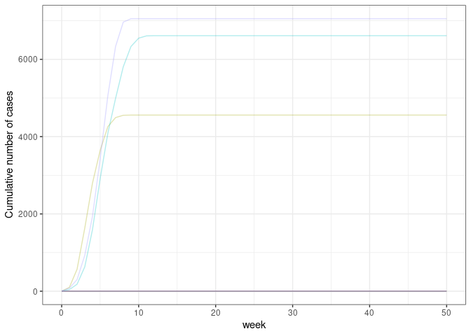

# *ringbp*: Simulate infectious disease transmission with contact tracing

<!-- badges: start -->


[](https://github.com/epiforecasts/ringbp/actions/workflows/R-CMD-check.yaml)
[](https://app.codecov.io/gh/epiforecasts/ringbp?branch=main)

[](https://opensource.org/licenses/MIT)
<!-- badges: end -->

*ringbp* is an R package that provides methods to simulate infectious
disease transmission in the presence of contact tracing. It was
initially developed to support a paper written in early 2020 to assess
the [feasibility of controlling
COVID-19](https://github.com/cmmid/ringbp). For more details on the
methods implemented here, see the associated
[paper](https://doi.org/10.1016/S2214-109X(20)30074-7).

## Installation

The current development version of *ringbp* can be installed from
[GitHub](https://github.com/) using the `pak` package.

``` r
if(!require("pak")) install.packages("pak")
pak::pak("epiforecasts/ringbp")
```

## Quick start

The main functionality of the package is in the `scenario_sim()`
function. Here is an example for running 10 simulations of a given
scenario:

``` r
library("ringbp")
library("ggplot2")

res <- scenario_sim(
  n = 10, ## 10 simulations
  initial_cases = 1, ## one initial case in each of the simulations
  prop_asymptomatic = 0, ## no asymptomatic infections
  prop_ascertain = 0.2, ## 20% probability of ascertainment by contact tracing
  cap_cases = 4500, ## don't simulate beyond 4500 infections
  cap_max_days = 350, ## don't simulate beyond 350 days
  r0_isolated = 0.5, ## isolated individuals have R0 of 0.5
  r0_community = 2.5, ## non-isolated individuals have R0 of 2.5
  disp_community = 0.16, ## dispersion parameter in the community
  disp_isolated = 1, ## dispersion  parameter of those isolated
  onset_to_isolation = \(x) stats::rweibull(n = x, shape = 1.651524, scale = 4.287786), ## time from onset to isolation
  incubation_period = \(x) stats::rweibull(n = x, shape = 2.322737, scale = 6.492272), ## incubation period
  k = 0, ## skew of generation interval to be beyond onset of symptoms
  quarantine = FALSE ## whether quarantine is in effect
)
```

### Plot of weekly cases

``` r
ggplot(
  data = res, aes(x = week, y = cumulative, col = as.factor(sim))
) +
  geom_line(show.legend = FALSE, alpha = 0.3) +
  scale_y_continuous(name = "Cumulative number of cases") +
  theme_bw()
```



### Estimate extinction probability

``` r
extinct_prob(res, cap_cases = 4500)
#> [1] 0.8
```

## Contributors

<!-- ALL-CONTRIBUTORS-LIST:START - Do not remove or modify this section -->
<!-- prettier-ignore-start -->
<!-- markdownlint-disable -->

All contributions to this project are gratefully acknowledged using the
[`allcontributors` package](https://github.com/ropensci/allcontributors)
following the [all-contributors](https://allcontributors.org)
specification. Contributions of any kind are welcome!

### Code

<a href="https://github.com/epiforecasts/ringbp/commits?author=seabbs">seabbs</a>,
<a href="https://github.com/epiforecasts/ringbp/commits?author=sbfnk">sbfnk</a>,
<a href="https://github.com/epiforecasts/ringbp/commits?author=jhellewell14">jhellewell14</a>,
<a href="https://github.com/epiforecasts/ringbp/commits?author=timcdlucas">timcdlucas</a>,
<a href="https://github.com/epiforecasts/ringbp/commits?author=amygimma">amygimma</a>,
<a href="https://github.com/epiforecasts/ringbp/commits?author=joshwlambert">joshwlambert</a>,
<a href="https://github.com/epiforecasts/ringbp/commits?author=Bisaloo">Bisaloo</a>,
<a href="https://github.com/epiforecasts/ringbp/commits?author=actions-user">actions-user</a>

### Issue Authors

<a href="https://github.com/epiforecasts/ringbp/issues?q=is%3Aissue+author%3Apearsonca">pearsonca</a>,
<a href="https://github.com/epiforecasts/ringbp/issues?q=is%3Aissue+author%3Asophiemeakin">sophiemeakin</a>

### Issue Contributors

<a href="https://github.com/epiforecasts/ringbp/issues?q=is%3Aissue+commenter%3Athimotei">thimotei</a>,
<a href="https://github.com/epiforecasts/ringbp/issues?q=is%3Aissue+commenter%3Aadamkucharski">adamkucharski</a>,
<a href="https://github.com/epiforecasts/ringbp/issues?q=is%3Aissue+commenter%3Adcadam">dcadam</a>,
<a href="https://github.com/epiforecasts/ringbp/issues?q=is%3Aissue+commenter%3Ajamesmbaazam">jamesmbaazam</a>

<!-- markdownlint-enable -->
<!-- prettier-ignore-end -->
<!-- ALL-CONTRIBUTORS-LIST:END -->
