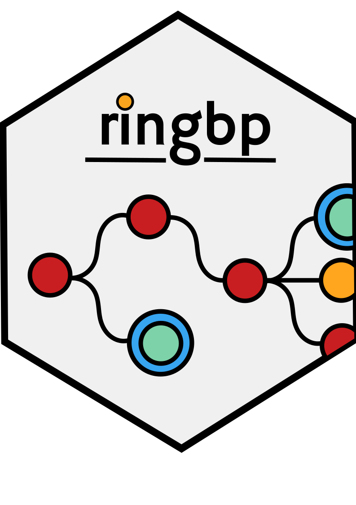
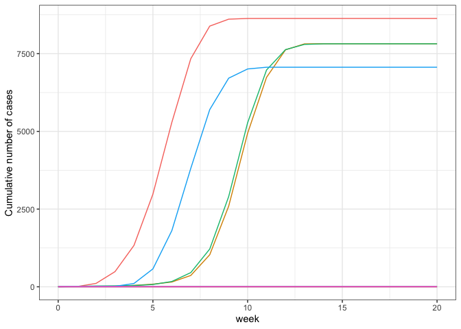

# `{ringbp}`: Simulate infectious disease transmission with contact tracing 

<!-- badges: start -->


[](https://github.com/epiforecasts/ringbp/actions/workflows/R-CMD-check.yaml)
[](https://app.codecov.io/gh/epiforecasts/ringbp?branch=main)

[](https://opensource.org/licenses/MIT)
[](https://doi.org/10.5281/zenodo.3749529)
<!-- badges: end -->

`{ringbp}` is an R package that provides methods to simulate infectious
disease transmission in the presence of contact tracing. It was based on
an Ebola transmission model with ring vaccination ([Kucharski et al.
2016](#ref-Kucharski2016)). The `{ringbp}` model was initially developed
to support a paper written in early 2020 to assess the feasibility of
controlling COVID-19 ([Hellewell et al. 2020](#ref-Hellewell2020)).

See the [companion analysis code](https://github.com/cmmid/ringbp) to
reproduce Hellewell et al. ([2020](#ref-Hellewell2020)).

For more details on the methods implemented in the `{ringbp}` R package,
see the Hellewell et al. ([2020](#ref-Hellewell2020))
[paper](https://doi.org/10.1016/S2214-109X(20)30074-7), and the [package
documentation](https://epiforecasts.io/ringbp/articles/).

## Installation

The package can be installed from CRAN using

``` r
install.packages("ringbp")
```

You can install the development version of `{ringbp}` from
[GitHub](https://github.com/) with:

``` r
# check whether {pak} is installed
if(!require("pak")) install.packages("pak")
pak::pak("epiforecasts/ringbp")
```

Alternatively, install pre-compiled binaries from [the epiforecasts
R-universe](https://epiforecasts.r-universe.dev/ringbp)

``` r
install.packages("ringbp", repos = c("https://epiforecasts.r-universe.dev", "https://cloud.r-project.org"))
```

## Quick start

The main functionality of the package is in the `scenario_sim()`
function. Here is an example for running 10 simulations of a given
scenario:

``` r
library("ringbp")
library("ggplot2")

res <- scenario_sim(
  n = 10, ## 10 simulations
  initial_cases = 1, ## one initial case in each of the simulations 
  offspring = offspring_opts(
    ## non-isolated individuals have R0 of 2.5 and a dispersion parameter
    community = \(n) rnbinom(n = n, mu = 2.5, size = 0.16), 
    ## isolated individuals have R0 of 0.5 and a dispersion  parameter
    isolated = \(n) rnbinom(n = n, mu = 0.5, size = 1)
    ## by default asymptomatic individuals are assumed to have the same R0 
    ## and dispersion as non-isolated individuals
  ), 
  delays = delay_opts(
    incubation_period = \(x) stats::rweibull(n = x, shape = 2.322737, scale = 6.492272), 
    onset_to_isolation = \(x) stats::rweibull(n = x, shape = 1.651524, scale = 4.287786)
  ),
  event_probs = event_prob_opts(
    ## 10% asymptomatic infections
    asymptomatic = 0.1, 
    ## 50% probability of onward infection time being before symptom onset
    presymptomatic_transmission = 0.5,
    ## 20% probability of ascertainment by contact tracing
    symptomatic_traced = 0.2
  ),
  ## whether quarantine is in effect
  interventions = intervention_opts(quarantine = FALSE),
  sim = sim_opts(
    ## don't simulate beyond 140 days
    cap_max_days = 140, 
    ## don't simulate beyond 4500 infections
    cap_cases = 4500
  )
)
```

### Plot of weekly cases

``` r
ggplot(
  data = res, aes(x = week, y = cumulative, col = as.factor(sim))
) +
  geom_line(show.legend = FALSE) +
  scale_y_continuous(name = "Cumulative number of cases") +
  theme_bw()
```



### Estimate extinction probability

``` r
extinct_prob(res)
#> Calculating extinction using the extinction status from the simulation.
#> [1] 0.6
```

## Contribute

Contributions to `{ringbp}` are welcomed. Please follow the [package
contributing
guide](https://github.com/epiforecasts/ringbp/blob/main/.github/CONTRIBUTING.md).

## Contributors

<!-- ALL-CONTRIBUTORS-LIST:START - Do not remove or modify this section -->

<!-- prettier-ignore-start -->

<!-- markdownlint-disable -->

All contributions to this project are gratefully acknowledged using the
[`allcontributors` package](https://github.com/ropensci/allcontributors)
following the [all-contributors](https://allcontributors.org)
specification. Contributions of any kind are welcome!

### Code

<a href="https://github.com/epiforecasts/ringbp/commits?author=seabbs">seabbs</a>,
<a href="https://github.com/epiforecasts/ringbp/commits?author=sbfnk">sbfnk</a>,
<a href="https://github.com/epiforecasts/ringbp/commits?author=jhellewell14">jhellewell14</a>,
<a href="https://github.com/epiforecasts/ringbp/commits?author=timcdlucas">timcdlucas</a>,
<a href="https://github.com/epiforecasts/ringbp/commits?author=amygimma">amygimma</a>,
<a href="https://github.com/epiforecasts/ringbp/commits?author=joshwlambert">joshwlambert</a>,
<a href="https://github.com/epiforecasts/ringbp/commits?author=Bisaloo">Bisaloo</a>,
<a href="https://github.com/epiforecasts/ringbp/commits?author=actions-user">actions-user</a>

### Issue Authors

<a href="https://github.com/epiforecasts/ringbp/issues?q=is%3Aissue+author%3Apearsonca">pearsonca</a>,
<a href="https://github.com/epiforecasts/ringbp/issues?q=is%3Aissue+author%3Asophiemeakin">sophiemeakin</a>

### Issue Contributors

<a href="https://github.com/epiforecasts/ringbp/issues?q=is%3Aissue+commenter%3Athimotei">thimotei</a>,
<a href="https://github.com/epiforecasts/ringbp/issues?q=is%3Aissue+commenter%3Aadamkucharski">adamkucharski</a>,
<a href="https://github.com/epiforecasts/ringbp/issues?q=is%3Aissue+commenter%3Adcadam">dcadam</a>,
<a href="https://github.com/epiforecasts/ringbp/issues?q=is%3Aissue+commenter%3Ajamesmbaazam">jamesmbaazam</a>

<!-- markdownlint-enable -->

<!-- prettier-ignore-end -->

<!-- ALL-CONTRIBUTORS-LIST:END -->

## Code of Conduct

Please note that the `{ringbp}` project is released with a [Contributor
Code of
Conduct](https://github.com/epiforecasts/.github/blob/main/CODE_OF_CONDUCT.md).
By contributing to this project, you agree to abide by its terms.

## References

<div id="refs" class="references csl-bib-body hanging-indent">

<div id="ref-Hellewell2020" class="csl-entry">

Hellewell, Joel, Sam Abbott, Amy Gimma, et al. 2020. “Feasibility of
Controlling COVID-19 Outbreaks by Isolation of Cases and Contacts.” *The
Lancet Global Health* 8 (4): e488–96.
<https://doi.org/10.1016/s2214-109x(20)30074-7>.

</div>

<div id="ref-Kucharski2016" class="csl-entry">

Kucharski, Adam J., Rosalind M. Eggo, Conall H. Watson, Anton Camacho,
Sebastian Funk, and W. John Edmunds. 2016. “Effectiveness of Ring
Vaccination as Control Strategy for Ebola Virus Disease.” *Emerging
Infectious Diseases* 22 (1): 105–8.
<https://doi.org/10.3201/eid2201.151410>.

</div>

</div>
