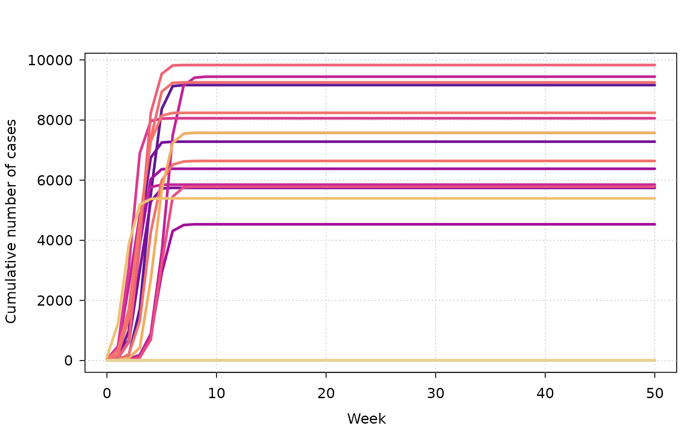
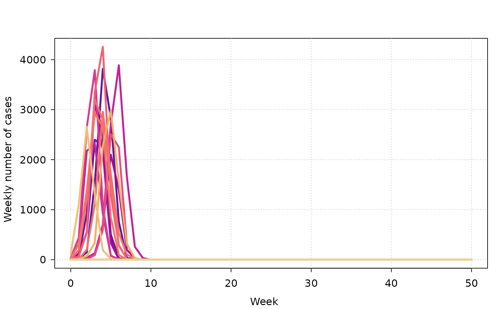

# Getting started with {ringbp}

## Introduction

Understanding how an infectious disease might spread, and under what
conditions it can be controlled, is crucial for public health planning.
The {ringbp} R package provides tools for simulating infectious disease
transmission using a branching process model with explicit
representation of case detection, isolation, and contact tracing. The
package was developed in the early phase of the COVID-19 pandemic to
support epidemiological analyses of outbreak dynamics and control
feasibility.

This vignette provides a brief introduction to the package and
demonstrates how to:

- load ringbp
- specify epidemiological parameters
- run outbreak simulations
- plot and summarise simulation results

It concludes with a simplified version of the analysis of COVID-19
control feasibility from Hellewell et al. ([2020](#ref-Hellewell2020)).

Firstly, we load the {ringbp} package, as well as the {data.table} and
{tinyplot} packages which are used in this vignette.

``` r
library(ringbp)
library(data.table)
library(tinyplot)
```

## Model overview

At its core, {ringbp} simulates outbreaks using a branching process
model. Each infected individual generates secondary infections according
to an offspring distribution, with modifications arising from:

- delays between infection, symptom onset, and isolation
- probabilities governing asymptomatic infection and case detection
- optional intervention mechanisms such as quarantine

Simulations are constructed by combining a set of options that describe
these components and then running one or more stochastic outbreak
realisations.

For a more detailed exposition of the {ringbp} epidemiological model and
how non-pharmaceutical interventions influence disease transmission see
the [`ringbp-model.Rmd`
vignette](https://epiforecasts.io/ringbp/articles/ringbp-model.md).

## Specifying model components

### Offspring distributions

The offspring distribution is a discrete probability distribution that
describes the random number of secondary infections
(offspring/descendants) generated by a single infected individual during
their entire infectious period.

The mean of the offspring distribution is the basic reproduction number
($R_{0}$), which is defined as the average number of secondary cases
caused by one infected individual in a fully susceptible population. The
model assumes that an infinite supply of susceptibles is always
available to infect, making it suitable for modelling of early outbreaks
of pathogens that have not previously spread in a population.

The number of secondary infections is defined using
[`offspring_opts()`](https://epiforecasts.io/ringbp/reference/offspring_opts.md).
Different distributions can be specified for individuals in the
community
([`community`](https://epiforecasts.io/ringbp/reference/offspring_opts.html#arg-community)),
those who are isolated
([`isolated`](https://epiforecasts.io/ringbp/reference/offspring_opts.html#arg-isolated))
and infected individuals that are asymptomatic (or paucisymptomatic)
([`asymptomatic`](https://epiforecasts.io/ringbp/reference/offspring_opts.html#arg-asymptomatic)).

``` r
offspring <- offspring_opts(
  community = \(n) rnbinom(n = n, mu = 2.5, size = 0.16),
  isolated = \(n) rgeom(n = n, prob = 0.8), 
  asymptomatic = \(n) rpois(n = n, lambda = 1.5)
)
```

The offspring distribution for asymptomatic individuals
([`asymptomatic`](https://epiforecasts.io/ringbp/reference/offspring_opts.html#arg-asymptomatic))
does not need to be specified, in which case it is assumed to be the
same as the offspring distribution of symptomatic infectors in the
community
([`community`](https://epiforecasts.io/ringbp/reference/offspring_opts.html#arg-community)).

### Delay distributions

Key epidemiological delays, such as the incubation period
([`incubation_period`](https://epiforecasts.io/ringbp/reference/delay_opts.html#arg-incubation-period))
and time from symptom onset to isolation
([`onset_to_isolation`](https://epiforecasts.io/ringbp/reference/delay_opts.html#arg-onset-to-isolation)),
are specified using
[`delay_opts()`](https://epiforecasts.io/ringbp/reference/delay_opts.md).

``` r
delays <- delay_opts(
  incubation_period = \(n) rlnorm(n, meanlog = 0.9, sdlog = 0.5),
  onset_to_isolation = \(n) rgamma(n, shape = 3, scale = 2)
)
```

*Isolation* is the separation of infectious individuals from others,
with the aim to prevent further transmission.

In the {ringbp} model, *isolated* individuals have their own
transmission dynamics (see
[`offspring_opts()`](https://epiforecasts.io/ringbp/reference/offspring_opts.md)
above). {ringbp} allows infected individuals in isolation to transmit
(i.e. non-zero reproduction number), and can even have higher
transmissibility than infectors in the community.

The arguments to both
[`offspring_opts()`](https://epiforecasts.io/ringbp/reference/offspring_opts.md)
and
[`delay_opts()`](https://epiforecasts.io/ringbp/reference/delay_opts.md)
are functions of `n`: they take an integer `n` and return a vector of
`n` random samples from a given distribution. This lets you sample
offspring or delay values for multiple individuals in a single step of
the simulation.

### Event probabilities

Probabilities governing infection and detection events are set using
[`event_prob_opts()`](https://epiforecasts.io/ringbp/reference/event_prob_opts.md).
The probability that an infector is asymptomatic
([`asymptomatic`](https://epiforecasts.io/ringbp/reference/event_prob_opts.html#arg-asymptomatic)),
the proportion of disease transmission that occurs before symptom onset
([`presymptomatic_transmission`](https://epiforecasts.io/ringbp/reference/event_prob_opts.html#arg-presymptomatic-transmission)),
and the proportion of symptomatic individuals that are ascertained by
contact tracing
([`symptomatic_ascertained`](https://epiforecasts.io/ringbp/reference/event_prob_opts.html#arg-symptomatic-ascertained)).

``` r
event_probs <- event_prob_opts(
  asymptomatic = 0.1,
  presymptomatic_transmission = 0.5,
  symptomatic_ascertained = 0.2
)
```

*Contact tracing* is the process of identifying and isolating people who
have been in contact with individuals that have tested positive for the
infection.

### Intervention options

Quarantine in the {ringbp} model is defined as the isolation of
individuals independent of their infection status. Contacts can be
isolated before they are symptomatic once the infecting individual is
confirmed to be infected and goes into isolation. It differs from
isolation in the model, which requires the infectee to be symptomatic.

Interventions, thus far only quarantine
([`quarantine`](https://epiforecasts.io/ringbp/reference/intervention_opts.html#arg-quarantine))
is implemented, can be turned on or off via
[`intervention_opts()`](https://epiforecasts.io/ringbp/reference/intervention_opts.md).

``` r
interventions <- intervention_opts(quarantine = FALSE)
```

By default, isolation of symptomatic cases is active and qurantine is
not active.

### Simulation controls

Finally, global simulation limits (for example, maximum duration
([`cap_max_days`](https://epiforecasts.io/ringbp/reference/sim_opts.html#arg-cap-max-days))
or outbreak size
([`cap_cases`](https://epiforecasts.io/ringbp/reference/sim_opts.html#arg-cap-cases)))
are specified using
[`sim_opts()`](https://epiforecasts.io/ringbp/reference/sim_opts.md).

``` r
sim <- sim_opts(
  cap_max_days = 350,
  cap_cases = 4500
)
```

## Running outbreak simulations

With all components defined, simulations can be run using
[`scenario_sim()`](https://epiforecasts.io/ringbp/reference/scenario_sim.md).
The example below runs 100 independent outbreak simulations starting
from a single initial case.

*Stochastic epidemic model*: the {ringbp} model uses random simulations
to reflect the inherent uncertainty in real‑world outbreaks.

We set the seed to ensure we have the same output each time the vignette
is rendered. When using {ringbp}, setting the seed is not required
unless you need to simulate the same outbreak multiple times.

``` r
set.seed(1)
```

``` r
outbreak <- scenario_sim(
  n = 100,
  initial_cases = 1,
  offspring = offspring,
  delays = delays,
  event_probs = event_probs,
  interventions = interventions,
  sim = sim
)
```

The returned object is a `data.table` containing the simulated outbreak
trajectories. The columns are:

- `sim`: simulation replicate ID
- `week`: outbreak week, zero indexed
- `weekly_cases`: number of new cases that week
- `cumulative`: cumulative weekly cases
- `effective_r0`: the effective reproduction number, the same for each
  simulation replicate
- `cases_per_gen`: the number of cases per generation of the outbreak

## Visualising results

A simple way to explore results is to plot cumulative cases over time.

``` r
tinyplot(
  cumulative ~ week | as.factor(sim), 
  data = outbreak, 
  type = "l", 
  lwd = 3,
  ylab = "Cumulative number of cases", 
  xlab = "Week",
  legend = FALSE,
  theme = "clean"
)
```



We can also plot the weekly incidence of cases. *Note*: the maximum
number of cases in the simulation is set to 4,500, so the decline in
cases to zero is due to reaching that upper bound.

``` r
tinyplot(
  weekly_cases ~ week | as.factor(sim), 
  data = outbreak, 
  type = "l", 
  lwd = 3,
  ylab = "Weekly number of cases", 
  xlab = "Week",
  legend = FALSE,
  theme = "clean"
)
```



## Summarising outcomes

A common quantity of interest is the probability that an outbreak goes
extinct (i.e. dies out without sustained transmission). This can be
calculated using
[`extinct_prob()`](https://epiforecasts.io/ringbp/reference/extinction.md).

``` r
extinct_prob(outbreak)
#> Calculating extinction using the extinction status from the simulation.
#> [1] 0.8
```

By default, extinction is defined as all infectious individuals have had
the opportunity to transmit but no new infections are generated. The
`extinction_week` argument in
[`extinct_prob()`](https://epiforecasts.io/ringbp/reference/extinction.md)
can also be used to specify whether extinction has happened by a certain
week, e.g. `extinct_prob(..., extinction_week = 5)` checks whether
extinction has occurred by week 5 of the outbreak. See
[`?extinct_prob`](https://epiforecasts.io/ringbp/reference/extinction.md)
for other methods of checking for extinction.

## Simplified COVID-19 contact tracing effectiveness analysis

Next we demonstrate how to use {ringbp} to reproduce a simplified
version of the outbreak control analysis from Hellewell et al.
([2020](#ref-Hellewell2020)). This study, published in the first months
of the COVID-19 pandemic, modelled the probability that an introduced
COVID-19 outbreak is contained by isolation and contact tracing.
Containment was defined as no disease transmission between weeks 12-16
of the outbreak and the outbreak not reaching 5,000 total cases.

Using the functions described above we define several parameter sets to
analyse how varying the basic reproduction number in the community, the
proportion of contacts successfully traced, and the number of initial
infectors that seed independent outbreaks influence the likelihood of
outbreak control.

This is a simplified version of the analysis from Hellewell et al.
([2020](#ref-Hellewell2020)), for the full analysis see the [GitHub
repository with the analysis scripts](https://github.com/cmmid/ringbp).

## Define epidemiological parameters

``` r
scenarios <- data.table(
  expand.grid(
    initial_cases = c(5, 20),
    r0_community = c(1.5, 2.5),
    symptomatic_ascertained = c(0, 0.5, 1)
  )
)
scenarios[, scenario :=  1:.N]
scenarios <- scenarios[, list(data = list(.SD)), by = scenario]
```

## Run the simulation

``` r
n <- 10

scenarios[, sims := lapply(data, \(x, n) {
  scenario_sim(
    n = n,
    initial_cases = x$initial_cases,
    offspring = offspring_opts(
      community = \(n) rnbinom(n = n, mu = x$r0_community, size = 0.16),
      isolated = \(n) rnbinom(n = n, mu = 0, size = 1)
    ),
    delays = delay_opts(
      incubation_period = \(n) rweibull(n, shape = 1.65, scale = 4.28),
      onset_to_isolation = \(n) rweibull(n, shape = 1.65, scale = 2.31)
    ),
    event_probs = event_prob_opts(
       asymptomatic = 0.1,
       presymptomatic_transmission = 0.1,
       symptomatic_ascertained = x$symptomatic_ascertained
    ),
    interventions = intervention_opts(quarantine = FALSE),
    sim = sim_opts(cap_max_days = 365, cap_cases = 5000)
  )
  },
  n = n
)]
```

For a more detailed example of running {ringbp} across multiple
parameter sets see the [`parameter-sweep.Rmd`
vignette](https://epiforecasts.io/ringbp/articles/parameter-sweep.md),
which also includes information on how to parallelise the simulation.

``` r

scenarios[, 
  pext := extinct_prob(sims[[1]], extinction_week = 12:16), 
  by = scenario
]
#> Calculating extinction as no new cases within weeks: 12 to 16 (inclusive).
#> Calculating extinction as no new cases within weeks: 12 to 16 (inclusive).
#> Calculating extinction as no new cases within weeks: 12 to 16 (inclusive).
#> Calculating extinction as no new cases within weeks: 12 to 16 (inclusive).
#> Calculating extinction as no new cases within weeks: 12 to 16 (inclusive).
#> Calculating extinction as no new cases within weeks: 12 to 16 (inclusive).
#> Calculating extinction as no new cases within weeks: 12 to 16 (inclusive).
#> Calculating extinction as no new cases within weeks: 12 to 16 (inclusive).
#> Calculating extinction as no new cases within weeks: 12 to 16 (inclusive).
#> Calculating extinction as no new cases within weeks: 12 to 16 (inclusive).
#> Calculating extinction as no new cases within weeks: 12 to 16 (inclusive).
#> Calculating extinction as no new cases within weeks: 12 to 16 (inclusive).

# probability of extinction for each scenario
scenarios$pext
#>  [1] 0.9 0.5 0.5 0.2 1.0 1.0 0.9 0.5 1.0 1.0 1.0 0.9
```

Hellewell et al. ([2020](#ref-Hellewell2020)) used {ringbp} to show
that:

- Outbreaks are controllable if contact tracing is fast and covers a
  high proportion of contacts
- Delays in isolating cases or many undetected asymptomatic cases make
  control unlikely
- Small initial clusters are easier to contain than larger ones

## {ringbp} Use Cases

This vignette has focused on the high-level workflow for running
simulations with {ringbp}. Further uses of the package include, but are
not limited to:

- Simulate outbreaks under different assumptions about $R_{0}$,
  incubation period, and proportion of asymptomatic infections.
- Explore the impact of delays in isolation and the effectiveness of
  contact tracing.
- Estimate the probability of outbreak extinction under different
  intervention strategies.

## References

Hellewell, Joel, Sam Abbott, Amy Gimma, Nikos I Bosse, Christopher I
Jarvis, Timothy W Russell, James D Munday, et al. 2020. “Feasibility of
Controlling COVID-19 Outbreaks by Isolation of Cases and Contacts.” *The
Lancet Global Health* 8 (4): e488–96.
<https://doi.org/10.1016/s2214-109x(20)30074-7>.
