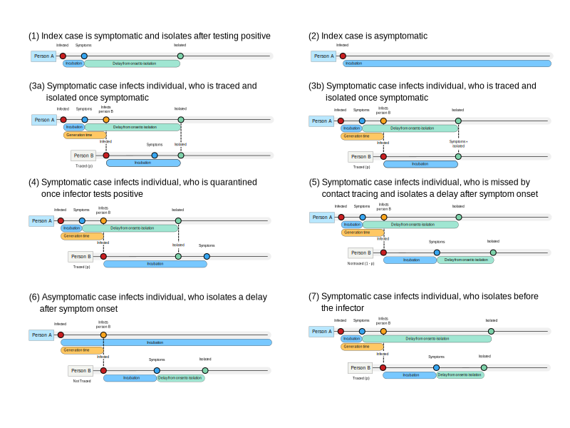
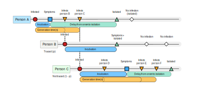
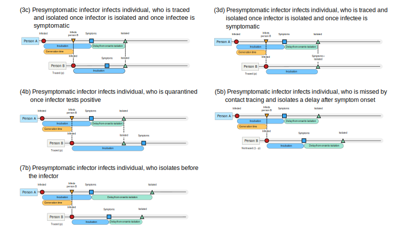
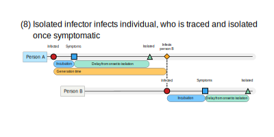
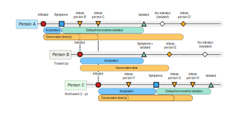

```{r, include = FALSE}
knitr::opts_chunk$set(
  collapse = TRUE,
  comment = "#>"
)
```

This vignette describes the epidemiological model implemented in the {ringbp} R package. 

## Model Overview

The {ringbp} outbreak model is an individual-level branching process model to simulate an epidemic with individual-level non-pharmaceutical interventions (NPIs), namely: isolation, contact tracing and quarantine. 

***Isolation***: Any case that becomes symptomatic gets tested, and will isolate after a symptom onset-to-isolation delay.

***Contact tracing***: If contact tracing is in operation the infectee can also be isolated as soon as they develop symptoms if the infector is isolating. Contact tracing in the {ringbp} model is adjusted by the proportion of contacts ascertained, which varies between 0% (i.e. nobody is contact traced) and 100% (i.e. every case has all their contacts traced).

***Quarantine***: If quarantine is activated in the model then an infectee can be isolated as soon as their infector goes into isolation, independent of whether they are symptomatic. Quarantine can be turned on or off in the {ringbp} model and affects the whole population.

In the scenarios that contacts are being traced in the model (i.e. the proportion of contacts ascertained > 0%), or quarantine is active, then the infectee is isolated at either the infector's isolation time or an onset-to-isolation delay after their symptom onset time, whichever happens earlier. This means that in scenarios where contact tracing and quarantine are active it is possible that infectees isolate before their infector.

## Transmission scenarios with interventions

Different combinations of transmission timing and intervention effectiveness produce distinct outcomes. The scenarios below illustrate how isolation and contact tracing interact with disease transmission in the model. The first two scenarios represent an index case that does not infect anyone. All other scenarios illustrate infection from a primary case (Person A) to a secondary case (Person B).

{width=800px}\

Scenarios (1) and (2) show situations where an index case is symptomatic or asymptomatic, respectively. Asymptomatic cases are assumed to remain subclinical throughout the course of their infection.

Scenarios (3a) and (3b) show what happense when a symptomatic infector transmits to a symptomatic infectee. The difference between (3a) and (3b) is that in (3b) the infectee develops symptoms later. As a result there is a short time delay between the infectee showing symptoms and then going into isolation when the infector isolates in (3a), whereas in (3b) the infectee goes into isolation as soon as they develop symptoms because the infector isolates at the same time or before the infectee's symptom onset.

Scenario (4) is the only scenario where quarantine is active. This scenario shows an example of an infectee being quarantined when the infector goes into isolation before the infectee's symptoms develop.

Scenario (5) is where contact tracing is either not active (e.g. proportion of contacts ascertained = 0%) or contact tracing is active but the tracing missed this individual (the probability of a contact being missed is (1 - the proportion of contacts ascertained)). In this scenario the infectee goes into isolation after an onset-to-isolation delay from becoming symptomatic and also after the infector goes into isolation. The reason the infectee goes into isolation after the infector is because the contact tracing system does not notify the contact due to them being missed.

Scenario (6) shows what happens when an asymptomatic case transmits. The symptomatic infectee isolates after a delay from becoming symptomatic. The infectee cannot be traced as the infector is unknown to the contact tracing (or quarantine) system due to never showing symptoms.

Scenario (7) demonstrates where an infectee can be isolated before their infector isolates because of variability in the onset-to-isolation delay. (This scenario is only possible when onset-to-isolation delays are drawn from a distribution, and cannot occur if all onset-to-isolation delays in the population are constant).

{width=800px}\
This schematic of the model shows an index case (Person A) and two individuals infected by Person A (Persons B and C). Each case in the 3-person outbreak shown has a time of infection (or exposure, shown by the red dot), a time of symptom onset (blue dot), the time they infect others (orange dot) and the isolation time (green dot). Some of the time delays between events are also illustrated. The time between exposure and symptom onset is the incubation period for the individual, the time between symptom onset and isolation is the onset-to-isolation delay, and the time between an individual being infected and infecting a secondary case is the generation time.

The schematic also shows a scenario in which isolation completely prevents disease transmission. These are shown by diamonds for infection events that would have happened if the case had not gone into isolation. In other words, these are cases averted.

## Presymptomatic transmission scenarios with interventions

All of the scenarios in the figure above assume that transmission occurs after the infector is symptomatic. The {ringbp} model can also model presymptomatic transmission. Below is another figure enumerating scenarios, but this time assuming that the infector infects the infectee before becoming symptomatic.

{width=800px}\

The scenarios in the presymptomatic transmission figure are linked by number to those in the postsymptomatic transmission scenarios figure. 

Scenario (3c) and (3d) show the same contact tracing scenario as (3a) and (3b) in the previous figure, but assume transmission occurs before symptom onset. 

Scenario (4b) shows the same active quarantine scenario as scenario (4). Scenario (4b) is the only presymptomatic transmission scenario that assumes quarantine is active.

Scenario (5b) is equivalent to scenario (5), illustrating what happens if an infectee is not traced because contact tracing ascertainment is not 100%, but for (5b) the transmission is presymptomatic.

Scenario (7b) corresponds to scenario (7) where the infectee isolates before the infector due to the shorter onset-to-isolation delay.

## Transmission in isolation

So far we have assumed that once cases are isolated they cannot transmit. However, the {ringbp} epidemic model allows the user to specify any offspring distribution for isolated cases. 

Infectees that are infected by someone isolating are not isolated until an onset-to-isolation delay after they become symptomatic.

{width=800px}\

Scenario (8) shows the case where Person A infects Person B after Person A enters isolation, and Person B isolates after a delay following symptom onset.

Below we show the same 3-person outbreak schematic as above, but this time isolation is assumed to be imperfect (or leaky) and the reproduction number in isolation is positive ($R_0^\mathrm{iso} > 0$). Person A and Person B transmit to Person D and Person E, respectively, from isolation.

{width=800px}\

## Model parameters

The table below includes the parameters mentioned in this vignette that can be specified by the user, and how it can be parameterised in the {ringbp} model.

| Epidemiological Parameter | {ringbp} Model Parameterisation |
| --- | ----------- |
| Incubation period distribution | `delay_opts(incubation_period = \(n) rgamma(n = n, shape = 2, scale = 2))` |
| Onset-to-isolation delay distribution | `delay_opts(onset_to_isolation = \(n) rgamma(n = n, shape = 2, scale = 2))` |
| Proportion of asymptomatic cases | `event_prob_opts(asymptomatic = 0.5)` |
| Proportion of presymptomatic transmission | `event_prob_opts(presymptomatic_transmission = 0.5)` |
| Contact tracing case ascertainment | `event_prob_opts(symptomatic_ascertained = 0.5)` |
| Quarantine | `intervention_opts(quarantine = TRUE)` |

In the {ringbp} model the generation time is not parameterised, instead it is the result of the incubation period distribution and the proportion of transmission that occurs presymptomatically. The minimum generation time can be set by specifying a `latent_period` in the `delay_opts()` function, however, a non-zero latent period may alter the proportion of presymptomatic transmission from what was set by the user.

For the purposes of illustration, the scenarios presented in this vignette include the fewest transmission events possible. The transmissibility of symptomatic or asymptomatic cases in the community, or cases in isolation in the simulation model can be set by specifying the offspring distribution using the `offspring_opts()` function.

The `scenario_sim()` function runs the {ringbp} model for a specified number of replicates.

## Further information

To see the exact implementation of transmission branching process model with NPIs please see the code in the `outbreak_step()` function.
